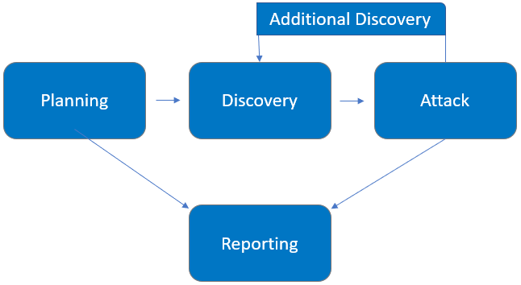

INSERT LOGO HERE

Demo Company

Security Assessment Findings Report

Business Confidential

date: BOILERPLATE_DATE
Project: 897-19
Version: 1.0

\pagebreak

# Confidentiality Statement

This document is the exclusive property of Demo Company (DC) and TCM Security (TCMS). This document contains proprietary and confidential information. Duplication, redistribution, or use, in whole or in part, in any form, requires consent of both DC and TCMS.

\newpage

# Disclaimer

A penetration test is considered a snapshot in time. The findings and recommendations reflect the information gathered during the assessment and not any changes or modifications made outside of that period.

Time-limited engagements do not allow for a full evaluation of all security controls. TCMS prioritized the assessment to identify the weakest security controls an attacker would exploit. TCMS recommends conducting similar assessments on an annual basis by internal or third-party assessors to ensure the continued success of the controls.

# Contact Information

| Name | Title | Contact Information |
| :---: | :---: | :---: |
| **Demo Company** |
| John Smith | VP, Information Security (CISO) | Office: (555) 555-5555 Email: [john.smith@demo.com](mailto:john.smith@demo.com) |
| John Smith | IT Manager | Office: (555) 555-5555 Email: [jim.smith@demo.com](mailto:jim.smith@demo.com) |
| John Smith | Network Engineer | Office: (555) 555-5555\nEmail: [joe.smith@demo.com](mailto:joe.smith@demo.com) |
| **TCM Security** |
| Heath Adams | Lead Penetration Tester | Office: (555) 555-5555 Email: [[hadams@tcm-sec.com](mailto:hadams@tcm-sec.com)](mailto:[hadams@tcm-sec.com](mailto:hadams@tcm-sec.com) |
| Bob Adams | Penetration Tester | Office: (555) 555-5555 Email: [badams@tcm-sec.com](mailto:badams@tcm-sec.com) |
| Rob Adams | Account Manager | Office: (555) 555-5555 Email: [radams@tcm-sec.com](mailto:radams@tcm-sec.com) |

\pagebreak

# Assessment Overview

From May 20th, 2019 to May 29th, 2019, DC engaged TCMS to evaluate the security posture of its infrastructure compared to current industry best practices that included an external penetration test. All testing performed is based on the NIST _SP 800-115 Technical Guide to Information Security Testing and Assessment, OWASP Testing Guide (v4), and customized testing frameworks_.

Phases of penetration testing activities include the following:

-   Planning – Customer goals are gathered and rules of engagement obtained.
    
-   Discovery – Perform scanning and enumeration to identify potential vulnerabilities, weak areas, and exploits.
    
-   Attack – Confirm potential vulnerabilities through exploitation and perform additional discovery upon new access.
    
-   Reporting – Document all found vulnerabilities and exploits, failed attempts, and company strengths and weaknesses.

# Assessment Components
## External Penetration Test
An external penetration test emulates the role of an attacker attempting to gain access to an internal network without internal resources or inside knowledge.  A TCMS engineer attempts to gather sensitive information through open-source intelligence (OSINT), including employee information, historical breached passwords, and more that can be leveraged against external systems to gain internal network access.  The engineer also performs scanning and enumeration to identify potential vulnerabilities in hopes of exploitation.

\pagebreak

# Finding Severity Ratings
The following table defines levels of severity and corresponding CVSS score range that are used throughout the document to assess vulnerability and risk impact.

<table>
<tr>
<th>SOMETHING</th>
<td style="background: red;">Test</td>
</tr>
</table>

| Severity | CVSS V3 Score Range | Definition |
| :---: | :---: | :---: |
| Critical | 9.0-10.0 | Exploitation is straightforward and usually results in system-level compromise.  It is advised to form a plan of action and patch immediately. |
| High | 7.0-8.9 | Exploitation is more difficult but could cause elevated privileges and potentially a loss of data or downtime.  It is advised to form a plan of action and patch as soon as possible. |
| Moderate | 4.0-6.9 | Vulnerabilities exist but are not exploitable or require extra steps such as social engineering.  It is advised to form a plan of action and patch after high-priority issues have been resolved. |
| Low | 0.1-3.9 | Vulnerabilities are non-exploitable but would reduce an organization’s attack surface.  It is advised to form a plan of action and patch during the next maintenance window. |
| Informational | N/A | No vulnerability exists.  Additional information is provided regarding items noticed during testing, strong controls, and additional documentation. |

\pagebreak

# Scope
| Assessment | Details | 
| :---: | :---: |
| External Penetraton Test | 192.168.0.0/24, 192.168.1.0/24 |

- Full scope information provided in “Demo Company-867-19 Full Findings.xslx”

## Scope Exclusions

Per client request, TCMS did not perform any Denial of Service attacks during testing.

## Client Allowances

DC did not provide any allowances to assist the testing.

\pagebreak

# Executive Summary
TCMS evaluated DC’s external security posture through an external network penetration test from May 20th, 2019 to May 29th, 2019.  By leveraging a series of attacks, TCMS found critical level vulnerabilities that allowed full internal network access to the DC headquarter office.  It is highly recommended that DC address these vulnerabilities as soon as possible as the vulnerabilities are easily found through basic reconnaissance and exploitable without much effort.

## Attack Summary

The following table describes how TCMS gained internal network access, step by step:

| Step | Action | Recommendation |
| :---: | :--- | :--- |
| 1 | Obtained historical breached account credentials to leverage against all company login pages | Discourage employees from using work e-mails and usernames as login credentials to other services unless necessary |
| 2 | Attempted a “credential stuffing” attack against Outlook Web Access (OWA), which was unsuccessful.  However, OWA provided username enumeration, which allowed TCMS to gather a list of valid usernames to leverage in further attacks. | Synchronize valid and invalid account messages. |
| 3 | Performed a “password spraying” attack against OWA using the usernames discovered in step 2.  TCMS used the password of Summer2018! (season + year + special character) against all valid accounts and gained access into the OWA application. | OWA permitted authenticated with valid credentials.  TCMS recommends DC implement Multi-Factor Authentication (MFA) on all external services.  OWA permitted unlimited login attempts.  TCMS recommends DC restrict logon attempts against their service.  TCMS recommends an improved password policy of: 1) 14 characters or longer 2) Use different passwords for each account accessed. 3) Do not use words and proper names in passwords, regardless of language  Additionally, TCMS recommends that DC:  - Train employees on how to create a proper password |
| 4 | Leveraged valid credentials to log into VPN | OWA permitted authenticated with valid credentials.  TCMS recommends DC implement Multi-Factor Authentication (MFA) on all external services. |
