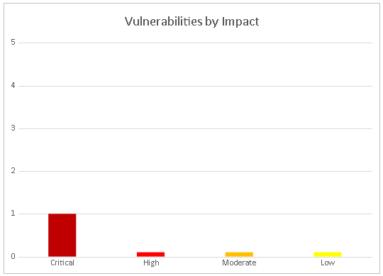
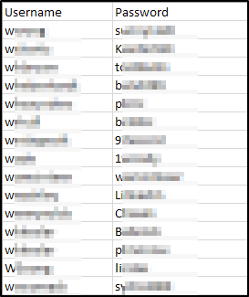
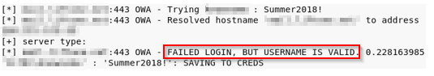
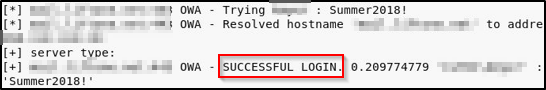

# Security Strengths
## SIEM alerts of vulnerability scans

During the assessment, the DC security team alerted TCMS engineers of detected vulnerability scanning against their systems.  The team was successfully able to identify the TCMS engineer’s attacker IP address within minutes of scanning and was capable of blacklisting TCMS from further scanning actions.

# Security Weaknesses
## Missing Multi-Factor Authentication

TCMS leveraged multiple attacks against DC login forms using valid credentials harvested through open-source intelligence.  Successful logins included employee e-mail accounts through Outlook Web Access and internal access via Active Directory login on the VPN.  The use of multi-factor authentication would have prevented full access and required TCMS to utilize additional attack methods to gain internal network access.

## Weak Password Policy

TCMS successfully performed password guessing attacks against DC login forms, providing internal network access.  A predictable password format of Summer2018! (season + year + special character) was attempted and successful.  

## Unrestricted Logon Attempts

During the assessment, TCMS performed multiple brute-force attacks against login forms found on the external network.  For all logins, unlimited attempts were allowed, which permitted an eventual successful login on the Outlook Web Access application.  

# Vulnerabilities by Impact

The following chart illustrates the vulnerabilities found by impact:

\pagebreak
## External Penetration Test Findings
### Insufficient Lockout Policy – Outlook Web App (Critical)
| | |
|---|---|
| **Description: **| DC allowed unlimited logon attempts against their Outlook Web App (OWA) services. This configuration allowed brute force and password guessing attacks in which TCMS used to gain access to DC’s internal network. |
| **Impact: **| Critical |
| **System: **| 192.168.0.5 |
| **References: **| [NIST SP800-53r4 AC-17](https://nvd.nist.gov/800-53/Rev4/control/AC-17) - Remote Access [NIST SP800-53r4 AC-7(1)](https://nvd.nist.gov/800-53/Rev4/control/AC-7#enhancement-1) - Unsuccessful Logon Attempts |Automatic Account Lock | 

### Exploitation Proof of Concept
TCMS gathered historical breached data found in credentials dumps.  The data amounted to 868 total account credentials (**Note:** A full list of compromised accounts can be found in “**Demo Company-867-19 Full Findings.xslx**”.).

*
Figure 1: Sample List of breached user credentials
*

TCMS used the gathered credentials to perform a credential stuffing attack against the OWA login page. Credential stuffing attacks take previously known credentials and attempt to use them on login forms to gain access to company resources. TCMS was unsuccessful in the attack but was able to gather additional sensitive information from the OWA server in the form of username enumeration.

*
Figure 2: OWA username enumeration
*

TCMS gathered the valid usernames and performed a password spraying attack. A password spraying attack attempts to use common passwords against known usernames in hopes of gaining access to company resources. TCMS attempted to use the common Summer2018! (season + year + special character) against all known valid usernames. A username returned as a successful login:

*
Figure 3: Successful OWA Login
*

TCMS leveraged the valid credentials to log into the client VPN portal and gain access to the internal network.
\pagebreak
### Remediation
| | |
|---|---|
| **Who:** | IT Team |
| **Vector:** | Remote | 
| **Action:** | Item 1: VPN and OWA login with valid credentials did not require Multi-Factor Authentication (MFA). TCMS recommends DC implement and enforce MFA across all external-facing login services.  Item 2: OWA permitted unlimited login attempts. TCMS recommends DC restrict logon attempts against their service.  Item 3: DC permitted a successful login via a password spraying attack, signifying a weak password policy. TCMS recommends the following password policy, per the Center for Internet Security (CIS): -   14 characters or longer -   Use different passwords for each account accessed -   Do not use words and proper names in passwords, regardless of language  Item 4: OWA permitted user enumeration. TCMS recommends DC synchronize valid and invalid account messages.  Additionally, TCMS recommends that DC: -   Train employees on how to create a proper password -   Check employee credentials against known breached passwords -   Discourage employees from using work e-mails and usernames as login credentials to other services unless absolutely necessary |
\pagebreak
### Additional Reports and Scans (Informational)

TCMS provides all clients with all report information gathered during testing.  This includes vulnerability scans and a detailed findings spreadsheet.  For more information, please see the following documents:

- **Demo Company-867-19 Full Findings.xslx**
- **Demo Company-867-19 Vulnerability Scan Summary.xslx**
- **Demo Company-867-19 Vulnerability Scan by Host.pdf**
